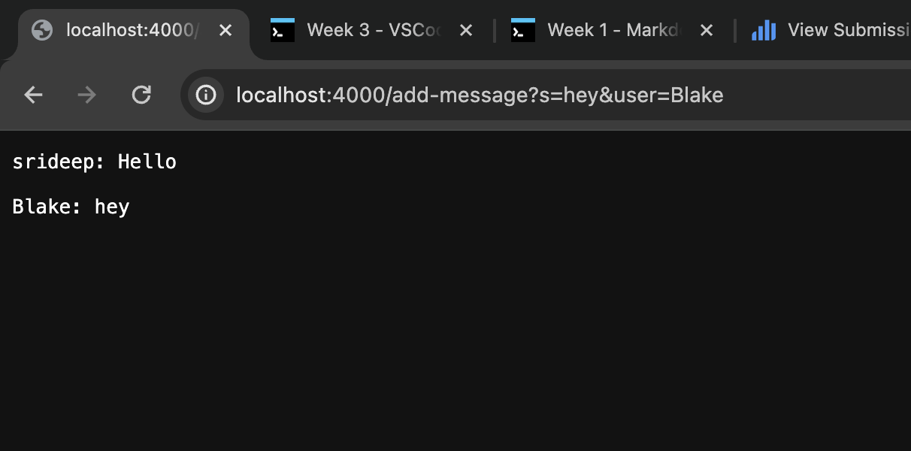

# Lab Report 2
---
Date: 01/30/2024

## Part 1:

**ChatServer.java:**

    import java.io.IOException;
    import java.net.URI;
    import java.util.ArrayList;

    class Handler implements URLHandler {
    	ArrayList<String> msgs = new ArrayList<String>();
        public String handleRequest(URI url) {
            if(url.getPath().equals("/add-message")){
                String message = url.getQuery().substring(url.getQuery().indexOf("s=") + 2, url.getQuery().indexOf("&"));
                String user = url.getQuery().substring(url.getQuery().indexOf("&user=") + 6);
                String s = String.format("%s: %s\n", user, message);
                msgs.add(s);
                return String.join("\n", msgs);
            }
            return "404 Not Found!";
        }
    }

    class ChatServer {
        public static void main(String[] args) throws IOException {
            if(args.length == 0){
                System.out.println("Missing port number! Try any number between 1024 to 49151");
                return;
            }
            int port = Integer.parseInt(args[0]);
            Server.start(port, new Handler());
        }
    }

## Images

The relevant methods called when this is run is first, the main() method is called. Then, a new Handler() object is created and the handleRequest() method is called. Once this method starts, it returns a String to display on the webpage.

The relevant arguments for the main() method is that you need to add a port number when running the file. This input will be stored in the args array. When the method handleRequest() is called, the relevant argument passed in is the url. The url is what stores the query that we need to match with a certain format. The instance ArrayList, msgs, stores all the messages sent, and they are joined together and returned at the end of handleRequest(). The variables message, user, and s are also used to handle the implementation inside the method.

The ArrayList msgs changes when this code was run in this moment. That's because I had to store the message in some area so that it could be printed out after consecutive queries. The message variable was "Hello" and the user variable was "srideep". The s variable joined the two together and formatted them as "srideep: Hello".

The relevant methods called when this is run is first, the main() method is called. Then, a new Handler() object is created and the handleRequest() method is called. Once this method starts, it returns a String to display on the webpage.

The relevant arguments for the main() method is that you need to add a port number when running the file. This input will be stored in the args array. When the method handleRequest() is called, the relevant argument passed in is the url. The url is what stores the query that we need to match with a certain format. The instance ArrayList, msgs, stores all the messages sent, and they are joined together and returned at the end of handleRequest(). The variables message, user, and s are also used to handle the implementation inside the method.

The ArrayList, msgs, adds a new element, which is the second message. This time, both the elements in msgs are joined together and returned. The message variable was "hey" and the user variable was "Blake". The s variable joined the two together and formatted them as "Blake: hey".

## Part 2:

The absolute path of the private key stored on my computer is: Users/srideepdornala/.ssh/id_rsa

The absolute path of the public key stored on ieng6 is: /home/linux/ieng6/oce/90/sdornala/.ssh/authorized_keys

Screenshot logging into ieng6 with no password insertion:

