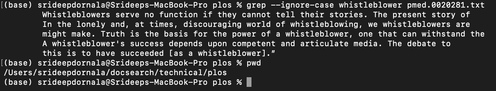

# Lab Report 3

## Part 1:

**Failure Inducing Input Test**

Input used: Integer array `{3,2,1}`

```
@Test 
public void testReverseInPlace() {
  int[] input1 = {3, 2, 1};
  ArrayExamples.reverseInPlace(input1);
  assertArrayEquals(new int[]{1, 2, 3}, input1);
}
```
**Passing Input**

Input used: Integer array of `{0}`

```
@Test 
public void testReverseInPlace() {
  int[] input1 = {0};
  ArrayExamples.reverseInPlace(input1);
  assertArrayEquals(new int[]{0}, input1);
}
```
**Symptoms**

Symptom of Failure Inducing Input:


Symptom of Passing Input:


**Before and After Bug was fixed**

The initial bug was that the array was being reversed without a temporary array being created to preserve the old array. For example, if the array was `{1,2,3}`, then the `reverseInPlace` method would first access the last element and change the first element to that. But when it comes time to access the first element and change the last element to that, the first element was already changed, so it would not work. That is why I created a temporary array to preserve the initial array and then reverse the initial array based on the elements in the temporary array.

Here is the method from before the bug was fixed:

```
static void reverseInPlace(int[] arr) {
  for(int i = 0; i < arr.length; i += 1) {
    arr[i] = arr[arr.length - i - 1];
  }
}
```

Here is the method after the bug was fixed:
```
static void reverseInPlace(int[] arr) {
  for(int i = 0; i < arr.length/2; i += 1) {
    int temp = arr[i];
    arr[i] = arr[arr.length - i - 1];
    arr[arr.length - i - 1] = temp;
  }
}
```
## Part 2:

### Grep Method Options:

**Option 1: ignore-case**

Example 1:

Present Working Directory: `/Users/srideepdornala/docsearch/technical/plos`

Command: `grep --ignore-case whistleblower pmed.0020281.txt`

Output:
```
Whistleblowers serve no function if they cannot tell their stories. The present story of
In the lonely and, at times, discouraging world of whistleblowing, we whistleblowers are
might make. Truth is the basis for the power of a whistleblower, one that can withstand the
A whistleblower's success depends upon competent and articulate media. The debate to
this is to have succeeded [as a whistleblower].”
```
Picture:


Example 2:

Present Working Directory: `/Users/srideepdornala/docsearch/technical`

Command: `grep -ir hepatic .`

Output:
```
./plos/pmed.0010013.txt:        technique for older patients with hepatic failure needing transplantation.
./plos/pmed.0010058.txt:        insulin-producing foreign cells within the hepatic parenchyma, the long-term consequences
./plos/pmed.0010045.txt:        and causes dysregulated hepatic glucose production, leading to insulin resistance [13,14].
./plos/pmed.0010045.txt:        thiazolidinedione suppression of resistin levels has recently been correlated with hepatic
./plos/pmed.0020140.txt:        excessive hepatic glucose release. An important issue is maintaining a physiological fluid
./plos/pmed.0020040.txt:        Metformin is in the class of biguanides and works by decreasing hepatic glucose output
./plos/pmed.0020040.txt:        which decreases overnight hepatic glucose production such that the patient begins the
./biomed/1471-2091-2-11.txt:          bile acids induce apoptosis in this non-hepatic derived
./biomed/1471-2091-2-11.txt:        acids in non-hepatic derived and non-bile acid metabolizing
./biomed/1471-2091-2-11.txt:        enterohepatic circulation, it would be reasonable to expect
./biomed/bcr583.txt:        gastrointestinal tract and reduces enterohepatic
./biomed/cc367.txt:        hepatobiliary procedures, such as hepatic resection [ 1, 2,
./biomed/cc367.txt:          respiratoryfailure, five patients (42%) had hepatic
./biomed/cc367.txt:          P = 0.002), hepatic failure ( 
./biomed/cc367.txt:        undergoing hepatic resection at our own institution [ 11].
./biomed/cc367.txt:        hepatic function and hepatic reserve in pre-operative
./biomed/1472-6904-2-7.txt:          "liver" blood flow corresponds to the hepatic artery. The
./biomed/1472-6904-2-7.txt:        clearance, tubular secretion and hepatic metabolism. One
./biomed/1472-6904-2-7.txt:        hepatic clearance, time dependence of cefazolin
./biomed/1476-4598-2-25.txt:          chiefly expressed by the hepatic cells. AngRP contain the
./biomed/1471-230X-2-21.txt:        with or without hepatic involvement. Therefore, in 60% of
./biomed/1471-230X-2-21.txt:        of hepatic disease varies from the unspecific (e.g.
./biomed/1471-230X-2-21.txt:        anti-ENA correlated positively with hepatic disease. An
./biomed/1471-230X-2-21.txt:        pathogenesis of hepatic damage in this disease, including
./biomed/gb-2003-4-5-r32.txt:          Hepatic cells comprise approximately 80% of the volume
```
Picture:


**Option 2: invert-match**

Example 1:

Present Working Directory: `/Users/srideepdornala/docsearch/technical/plos`

Command: `grep --invert-match the pmed.0020281.txt`

Output:
```
whistleblowing—as discussed, in part, in 
courageous men and women [1, 2] For that reason, those of us who congregated in Washington,
research.
misrepresented pharmaceuticals; clinical research trial results that have been sequestered
pharmaceuticals that are detailed to physicians, not to save lives or necessarily improve
corporations and political interests whose operations we occasionally challenge. Our goal
assault of unprecedented odds against being heard put forth by that sum of political power,
expediency, and money.
A whistleblower's success depends upon competent and articulate media. The debate to
making—cannot proceed or flourish without it.
Ralph Waldo Emerson, American essayist and philosopher (1803–1882), commented about
this is to have succeeded [as a whistleblower].”
```
Picture:


Example 2:

Present Working Directory: `/Users/srideepdornala/docsearch/technical/biomed`

Command: `grep -vr a .`

Output:
```
./1472-6807-2-2.txt:
./1472-6807-2-2.txt:  
./1472-6807-2-2.txt:    
./1472-6807-2-2.txt:      
./1472-6807-2-2.txt:        been developed for the prediction of MHC-peptide binding [
./1472-6807-2-2.txt:        10 11 12 13 14 15 16 17 18 19 20 21 22 23 24 25 26 ] .
./1472-6807-2-2.txt:        B *3501, B *5301, H-2K B, H-2D B, H-2D D, H-2L D, DR1, DR2,
./1472-6807-2-2.txt:        improvement in the MHC-peptide binding prediction. [ 21 22
./1472-6807-2-2.txt:        diversity. The objective of this study is to find which
./1472-6807-2-2.txt:        molecules.
./1472-6807-2-2.txt:      
./1472-6807-2-2.txt:      
./1472-6807-2-2.txt:        Results
./1472-6807-2-2.txt:        sequences constituting the MHC-peptide complexes. The
./1472-6807-2-2.txt:        6).
./1472-6807-2-2.txt:        complexes.
```
Picture:


**Option 3: count**

Example 1:

Present Working Directory: `/Users/srideepdornala/docsearch/technical/biomed`

Command: `grep --count hepatic 1471-230X-2-23.txt`

Output:
```
6
```

Picture:


Example 2:

Present Working Directory: `/Users/srideepdornala/docsearch/technical/biomed`

Command: `grep -cr hepatic .`

Output:
```
./1472-6807-2-2.txt:0
./1471-2350-4-3.txt:0
./1471-2156-2-3.txt:0
./1471-2156-3-11.txt:0
./1471-2121-3-10.txt:0
./1471-2172-3-4.txt:0
./gb-2002-4-1-r2.txt:0
./gb-2003-4-6-r41.txt:0
./1471-2466-1-1.txt:0
./1471-2199-2-10.txt:0
./1471-2202-2-9.txt:0
./cc991.txt:0
./1471-2369-3-9.txt:0
./bcr620.txt:0
./1476-069X-2-4.txt:0
./1472-6750-3-11.txt:0
./1471-2164-2-9.txt:0
./1471-2091-2-10.txt:0
./gb-2001-2-4-research0010.txt:0
./gb-2003-4-4-r24.txt:0
./1471-213X-2-1.txt:0
./1472-6882-3-3.txt:0
./1471-2407-2-3.txt:0
./ar331.txt:0
./ar319.txt:0
./1471-2156-4-5.txt:0
./1471-2431-2-1.txt:0
./1476-4598-2-22.txt:0
./1471-2180-2-22.txt:0
./1471-2334-3-9.txt:0
./1471-2091-2-11.txt:3
```

Picture:


**Option 4: max-count**

Example 1:

Present Working Directory: `/Users/srideepdornala/docsearch/technical/biomed`

Command: `grep --max-count 2 hepatic 1471-230X-2-21.txt`

Output:
```
with or without hepatic involvement. Therefore, in 60% of
of hepatic disease varies from the unspecific (e.g.
```

Picture:


Example 2:

Present Working Directory: `/Users/srideepdornala/docsearch/technical/biomed`

Command: `grep -r -m 1 Competing .`

Output:
```
./1471-2350-4-3.txt:        Competing Interests
./1471-2466-1-1.txt:        Competing interests
./1471-2369-3-9.txt:        Competing interests
./bcr620.txt:        Competing interests
./1476-069X-2-4.txt:        Competing interests
./1472-6882-3-3.txt:        Competing Interests
./1471-2407-2-3.txt:        Competing interests
./1471-2431-2-1.txt:        Competing interests
./1471-2334-3-9.txt:        Competing Interests
./bcr635.txt:        Competing interests
./1468-6708-3-10.txt:        Competing Interests
./1471-2458-3-20.txt:        Competing Interests
./1471-2350-4-2.txt:        Competing interests
./1476-0711-2-7.txt:        Competing interests
./1472-6947-3-8.txt:        Competing interests
./1471-2407-3-18.txt:        Competing interests
```

Picture:


