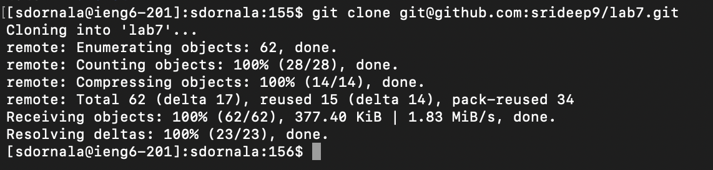
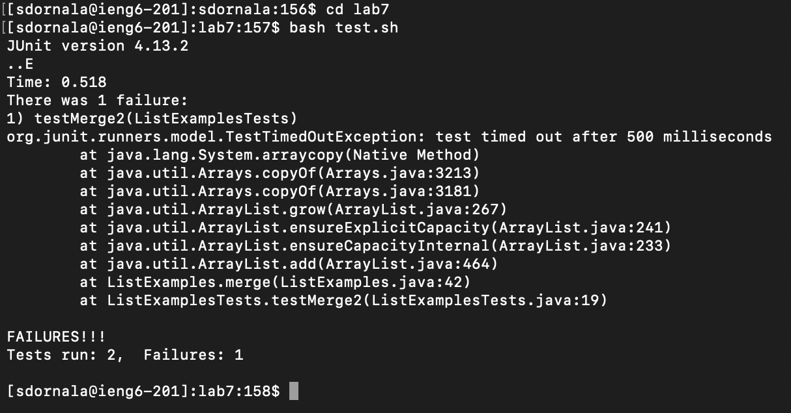
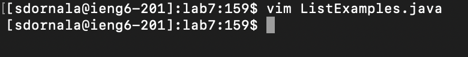
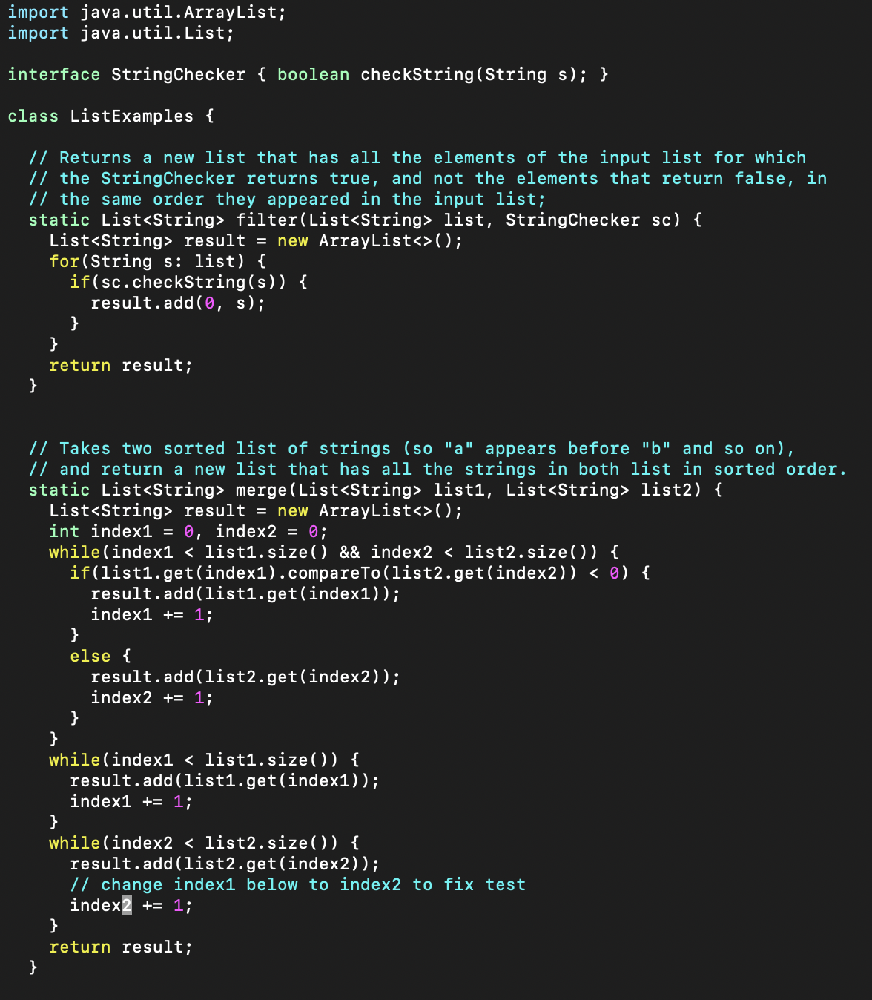
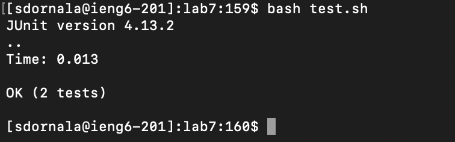
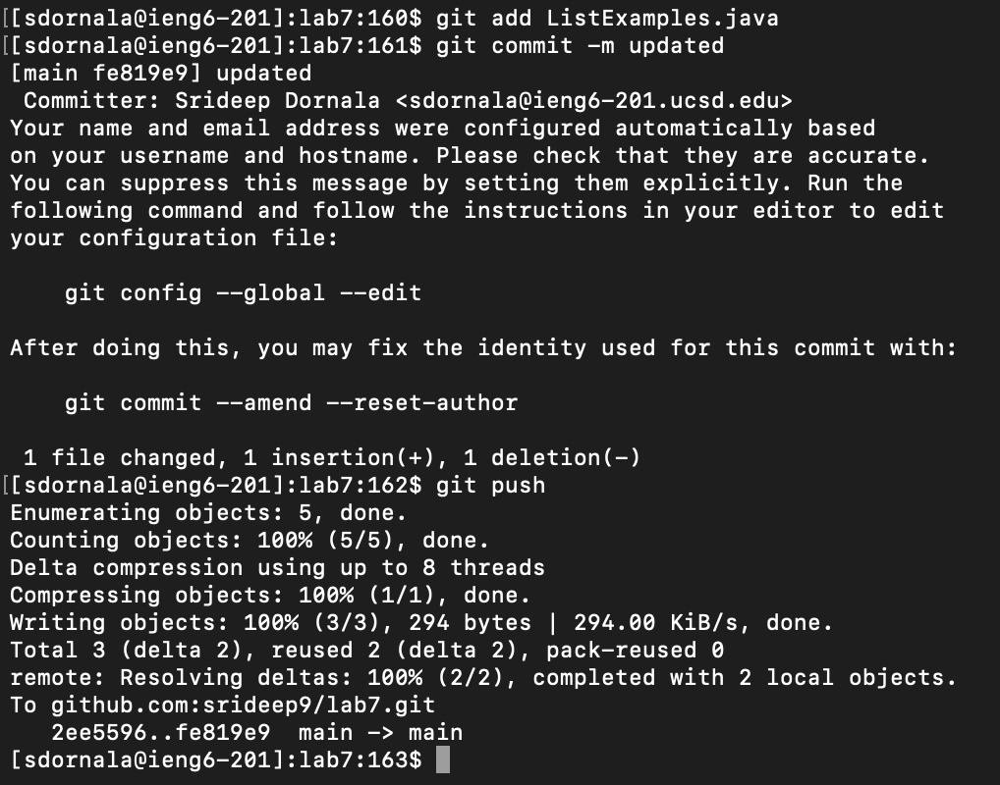

# Lab Report 4

## Step 4:

**Screenshots:**

**Key Presses:**
`s s h <space> s d o r n a l a @ i e n g 6 - 2 0 1 . u c s d . e d u <enter> p w d <enter> c s 1 5 l w i 2 4 <enter> l s <enter>`

**Summary:**
First, I use the ssh command along with my login to get into my ieng6 machine. I do not need to provide a password because of my ssh key from week 3. Once I logged on, I used pwd to simply see my present working directory. This isn't necessary but it is something I do just to gain an understanding of the home directory. I then type in `cs15lwi24` because I need to begin work for that course and the ieng6 login output says I should. I then used the `ls` command to see what files were currently in the home directory, and I made sure I deleted the lab7 cloned repository from the previous trial runs.

## Step 5:

**Screenshots:**

**Key Presses:**
`g i t <space> c l o n e <cmd+v> <enter>`

**Summary:**

I used the git clone command to clone the lab 7 repository. I cloned it using the ssh address provided on github.com. I copied that address and pasted it onto the command line.

## Step 6:

**Screenshots:**

**Key Presses:**
`b a s h <space> t e s t . s h  <enter>`

**Summary:**
Here, I used the `bash` command to run a script with the testing command syntax. This speeds up the process significantly as you can shorten the amount of things you need to type into the command line.

## Step 7:

**Screenshots:**

**Key Presses:**
`v i m <space> L i s t E x a m p l e s . j a v a <enter> 4 3 j e x i 2 <escape> : w q`

**Summary:**
I opened `ListExamples.java` using the vim command in the vim editor. I then skipped to line 43 using 43j, and then went to the end of the first word in that line using e. I then used x to remove the `1` in `index1` and replaced it with `2` by entering insert mode using `i` and then pressing `2`. I then clicked escape and then went back to the normal mode, and saved and quit using `:wq`.

## Step 8:

**Screenshots:**

**Key Presses:**
`b a s h <space> t e s t . s h  <enter>`

**Summary:**
Here, I used the `bash` command to run a script with the testing command syntax. This speeds up the process significantly as you can shorten the amount of things you need to type into the command line. This time the tests run fine because I fixed the error using vim.

## Step 9:

**Screenshots:**

**Key Presses:**
`g i t <space> a d d <space> L i s t E x a m p l e s . j a v a <enter> g i t <space> c o m m i t <space> - m <space> u p d a t e d <enter> g i t <space> p u s h`

**Summary:**
In this step, I first add the changes I made in `ListExamples.java` to the queue of changes I want to commit using the `git add` command. Then, I committed those changes using the `git commit` command. I also included the `-m` option which allows you to add a message, and added the word `updated` as the message. Then, I used `git push` to push the changes to the repository on my github account.
